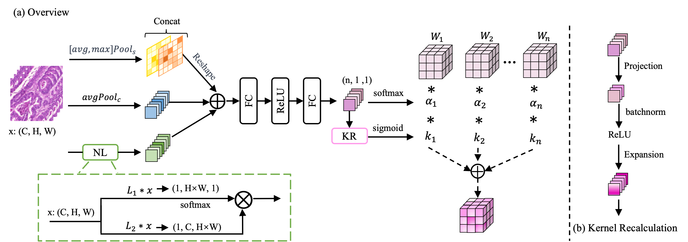

# MAGIC

This is the implementation of MAGIC: Rethinking Dynamic Convolution Design for Medical Image Segmentation. 

## Architectures

### Our MAGIC comprises two main components: i) Dimensional-Reciprocal Fusion, which models multi-dimensional information to compute convolutional kernels; ii) Kernel Recalculation, which learns the correlation among kernels for aggregation.

